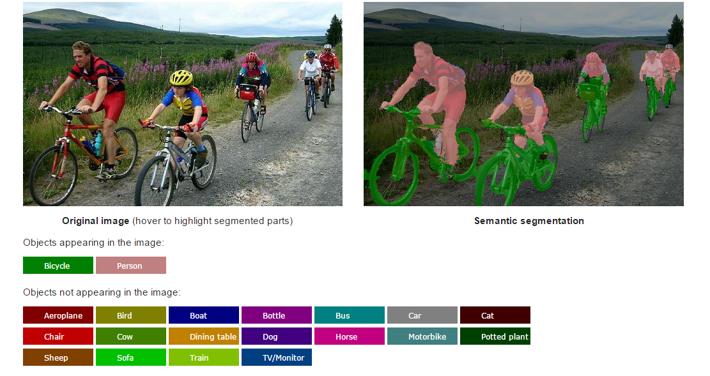

# CRF-RNN for Semantic Image Segmentation - Keras/Tensorflow version


<b>Live demo:</b> &nbsp;&nbsp;&nbsp;&nbsp; [http://crfasrnn.torr.vision](http://crfasrnn.torr.vision) <br/>
<b>Caffe version:</b> [http://github.com/torrvision/crfasrnn](http://github.com/torrvision/crfasrnn)<br/>

This repository contains Keras/Tensorflow code for the "CRF-RNN" semantic image segmentation method, published in the ICCV 2015 paper [Conditional Random Fields as Recurrent Neural Networks](http://www.robots.ox.ac.uk/~szheng/papers/CRFasRNN.pdf). This paper was initially described in an [arXiv tech report](http://arxiv.org/abs/1502.03240). The [online demo](http://crfasrnn.torr.vision) of this project won the Best Demo Prize at ICCV 2015. Original Caffe-based code of this project can be found [here](https://github.com/torrvision/crfasrnn). Results produced with this Keras/Tensorflow code are almost identical to that with the Caffe-based version.

If you use this code/model for your research, please cite the following paper:
```
@inproceedings{crfasrnn_ICCV2015,
    author = {Shuai Zheng and Sadeep Jayasumana and Bernardino Romera-Paredes and Vibhav Vineet and
    Zhizhong Su and Dalong Du and Chang Huang and Philip H. S. Torr},
    title  = {Conditional Random Fields as Recurrent Neural Networks},
    booktitle = {International Conference on Computer Vision (ICCV)},
    year   = {2015}
}
```

## Installation Guide

### 1.1  Install dependencies

Install [Tensorflow](https://www.tensorflow.org/install/) and [Keras](https://keras.io/#installation), following the respective installation guides. You will need to install Keras with HDF5/h5py if you plan to use the provided trained model. After installing these two packages, run the following commands to make sure they are properly installed:
```
# First, activate the correct Python virtualenv if you used one during Tensorflow/Keras installation
$ source /home/user/tensorflow_virtualenv/bin/activate  
$ python
>>> import tensorflow
>>> import keras
```
You should not see any errors while importing `tensorflow` and `keras` above.

### 1.2  Build CRF-RNN custom C++ code

Checkout the code in this repository, activate the Tensorflow/Keras virtualenv (if you used one), and run the `compile.sh` script in the `cpp` directory. That is, run the following commands:
```
$ git clone https://github.com/sadeepj/crfasrnn_keras.git
$ cd crfasrnn_keras/cpp
$ source /home/user/tensorflow_virtualenv/bin/activate
$ ./compile.sh
``` 
If the build succeeds, you will see a new file named `high_dim_filter.so`. If it fails, please see the comments inside the `compile.sh` file for help. You could also refer to the official Tensorflow guide for [building a custom op](https://www.tensorflow.org/extend/adding_an_op#build_the_op_library).

*Note*: This script will not work on Windows OS. If you are on Windows, please check [this issue](https://github.com/tensorflow/models/issues/1103) and the comments therein. The official Tensorflow guide for building a custom op does not yet include build instructions for Windows.

### 1.3  Download the pre-trained model weights

Download the model weights from [here](https://goo.gl/ciEYZi) and place it in the `crfasrnn_keras` directory with the file name `crfrnn_keras_model.h5`.

### 1.4  Run the demo
```
$ cd crfasrnn_keras
$ python run_demo.py  # Make sure that the correct virtualenv is already activated
```
If everything goes well, you will see the segmentation results in a file named "labels.png"


## Limitations of the Current Version
1. Currently, some operations in the CRF-RNN layer can only run on the CPU. An all-GPU version will be released soon.
2. The `crfrnn_keras_model.h5` model was directly converted from the [Caffe model](https://github.com/torrvision/crfasrnn). However, training new models entirely from Keras is possible too.
3. Current implementation of CrfRnnLayer only supports batch_size == 1
